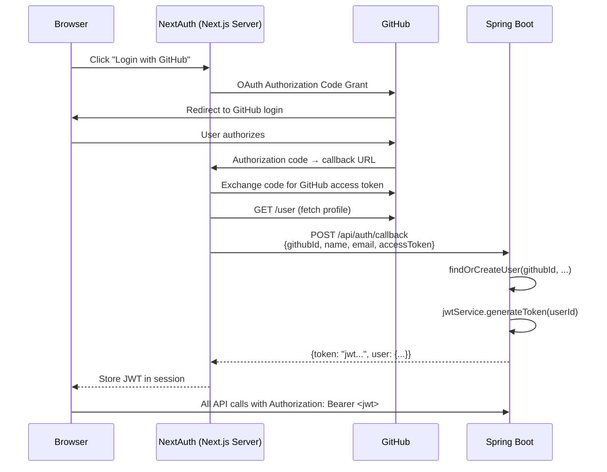
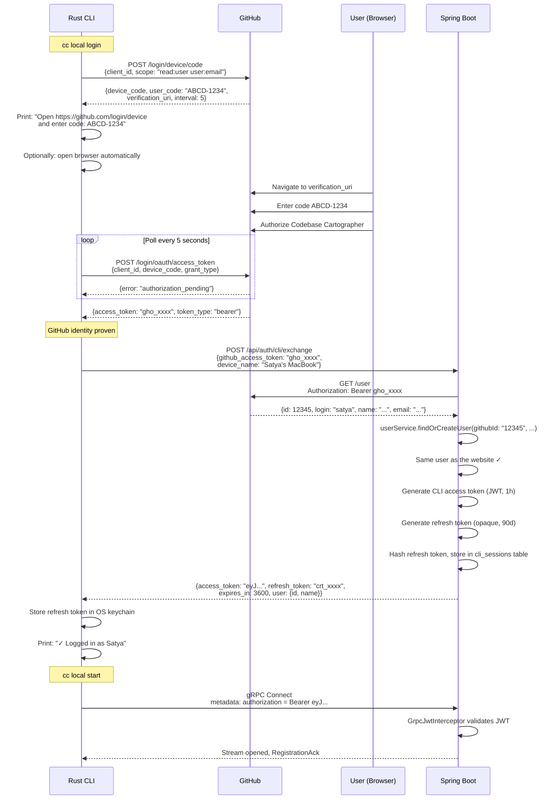

# CLI Authentication Architecture — Deep Analysis

## 1. Current Authentication Architecture



**Key observations from the codebase:**

| Aspect | Current State |
|---|---|
| OAuth provider | GitHub (Authorization Code Grant) |
| OAuth handling | **NextAuth** on the Next.js server — Spring Boot never talks to GitHub's OAuth endpoints directly |
| Identity key | `githubId` (unique in `users` table) |
| Credential | Single JWT with `userId` as subject, HMAC-SHA256 signed |
| Expiration | 24 hours (`JWT_EXPIRATION=86400000`) |
| Refresh tokens | **None** — user re-authenticates via GitHub when JWT expires |
| Token revocation | **None** — commented TODO for Dragonfly blacklist in [AuthController](file:///home/satya/Documents/Insights/Backend/api/src/main/java/com/codebasecartographer/api/controller/AuthController.java#L41-L44) |
| GitHub token storage | Stored in `users.access_token` — used for GitHub API calls (repo access), not for authentication |
| Trust model | Spring Boot **trusts NextAuth** to send valid `{githubId, name, email}` — there is no server-side verification of the GitHub token at the auth boundary |

> [!WARNING]
> The current browser flow relies on NextAuth being a trusted intermediary. The CLI cannot use this same trust model because the CLI is an untrusted client running on the user's machine. The CLI cannot be trusted to self-report its own `githubId`. Spring Boot must independently verify the CLI's identity.

---

## 2. Can We Reuse the Existing GitHub OAuth Application?

**Yes, with one manual configuration change.**

GitHub OAuth Apps support multiple grant types simultaneously. The same `client_id` that NextAuth uses for the Authorization Code Grant can also be used by the CLI for the Device Flow. These are independent capabilities of the same OAuth App.

**What you need to do in GitHub:**

1. Go to **GitHub → Settings → Developer Settings → OAuth Apps → your app**
2. Check the box: **"Enable Device Flow"**
3. That's it. No new app needed.

> [!IMPORTANT]
> The CLI will use the `client_id` (which is a **public** value — GitHub explicitly documents it as non-secret) and will **not** use the `client_secret`. The Device Flow is designed for public clients. The `client_secret` stays on your server only.

---

## 3. Recommended Authentication Architecture

### The core principle

```text
GitHub  ──►  Identity Provider (proves "who is this person?")
Spring Boot  ──►  Credential Issuer (grants application-level access)
```

The CLI should **never** use a GitHub token for ongoing gRPC authentication. GitHub tokens are:
- Scoped to GitHub's API, not to yours
- Subject to GitHub's expiration and rate-limiting policies
- Over-privileged (they grant access to repos, which the gRPC connection doesn't need)

Instead, the GitHub token is used **once** during login to prove identity. Spring Boot then issues its own credentials.

### Token architecture

```text
┌──────────────────────────────────────────────────────────────┐
│                    User Account                              │
│                    (users.id)                                │
│                                                              │
│   ┌────────────────────┐    ┌─────────────────────────────┐  │
│   │   Browser Session  │    │   CLI Session(s)            │  │
│   │                    │    │                             │  │
│   │   JWT (24h)        │    │   Access JWT (1h)           │  │
│   │   No refresh token │    │   + Refresh Token (90d)     │  │
│   │   Re-login via     │    │   Stored in OS keychain     │  │
│   │   GitHub OAuth     │    │   Revocable from website    │  │
│   │                    │    │                             │  │
│   └────────────────────┘    ├─────────────────────────────┤  │
│                             │   CLI Session 2 (laptop)    │  │
│                             │   Independent refresh token │  │
│                             └─────────────────────────────┘  │
└──────────────────────────────────────────────────────────────┘
```

**Why separate CLI token lifetimes from browser tokens:**

| Concern | Browser | CLI |
|---|---|---|
| Session duration | Tab/day | Weeks/months |
| User interaction | User is present, can re-login | Unattended, headless |
| Refresh capability | Not needed (user re-authenticates) | **Essential** (no human present to re-login) |
| Revocation need | Low (user closes tab) | **High** (user may want to disconnect a device remotely) |
| Storage | Browser memory/session | OS keychain on disk |

A 24-hour JWT with no refresh token is fine for a browser session. It is completely wrong for a long-running headless agent.

### CLI access token vs browser JWT

Both are JWTs signed by the same `JwtService` with the same secret. Both contain `userId` as the subject. The `GrpcJwtInterceptor` and the `JwtAuthFilter` both call the same `JwtService.validateToken()`. No separate validation logic is needed.

The only differences:

| Property | Browser JWT | CLI JWT |
|---|---|---|
| Expiration | 24 hours | 1 hour |
| Paired with refresh token | No | Yes |
| Contains `type` claim | No (optional to add) | `"type": "cli"` |
| Contains `session_id` claim | No | Yes (links to `cli_sessions` row) |

The `type` and `session_id` claims are not required for basic auth to work. They exist so that the server can, if needed, reject a CLI token at a browser-only endpoint (or vice versa), and so that token revocation can target a specific session.

---

## 4. Complete Login Sequence



### Why the CLI talks to GitHub directly (not through Spring Boot)

The Device Flow is designed so the client (`CLI`) interacts directly with the identity provider (`GitHub`). Making Spring Boot a middleman would mean:
- Two extra network hops per poll request (CLI → Spring Boot → GitHub → Spring Boot → CLI)
- Spring Boot needs to store `device_code` state temporarily
- No security benefit — the `client_id` is public by design

The only part where Spring Boot participates is the **token exchange** (`POST /api/auth/cli/exchange`) — this is where Spring Boot independently verifies the GitHub identity and issues its own credential.

---

## 5. Token Lifecycle

### Access Token

```text
Created:     On login, and on each refresh
Expiration:  1 hour
Storage:     CLI keeps in memory (never written to disk)
Validated:   By GrpcJwtInterceptor at stream establishment
Revocation:  Not needed — short-lived, expires naturally
```

### Refresh Token

```text
Created:     On login
Expiration:  90 days
Storage:     CLI stores in OS keychain (keyring crate)
             Server stores SHA-256 hash in cli_sessions table
Validated:   By POST /api/auth/cli/refresh
Revocation:  User can revoke from website ("Manage Devices")
             Or admin can revoke server-side
Rotation:    Each refresh issues a NEW refresh token and
             invalidates the old one (refresh token rotation)
```

### Refresh Token Rotation

When the CLI calls `POST /api/auth/cli/refresh`:

```text
1. CLI sends: { refresh_token: "crt_old" }
2. Server: hash("crt_old") → look up in cli_sessions
3. Server: verify not revoked, not expired
4. Server: generate new access token
5. Server: generate NEW refresh token "crt_new"
6. Server: update cli_sessions row with hash("crt_new")
7. Server: return { access_token, refresh_token: "crt_new" }
8. CLI: replace old refresh token in keychain with new one
```

This means a stolen refresh token can only be used once. After legitimate use rotates it, the stolen copy becomes invalid.

### gRPC Connection and Token Expiry

```text
Scenario: CLI connects at T=0 with a 1-hour access token.
          Stream stays open for 5 hours. Token "expired" at T=1h.

Is this a problem? No.
```

The `GrpcJwtInterceptor` validates the token **once** at stream establishment. After that, the stream is authenticated for its lifetime. This is standard gRPC practice — metadata is connection-scoped, not per-message.

If the stream drops at T=3h and the CLI needs to reconnect:
1. The original access token is expired.
2. CLI calls `POST /api/auth/cli/refresh` with its refresh token.
3. Gets a new access token.
4. Reconnects with the fresh token.

This is invisible to the user. The CLI handles it automatically.

### Session Database Schema

```sql
CREATE TABLE cli_sessions (
    id            UUID PRIMARY KEY DEFAULT gen_random_uuid(),
    user_id       VARCHAR(255) NOT NULL REFERENCES users(id),
    token_hash    VARCHAR(64)  NOT NULL UNIQUE,  -- SHA-256 hex
    device_name   VARCHAR(255) NOT NULL,
    created_at    TIMESTAMP    NOT NULL DEFAULT now(),
    expires_at    TIMESTAMP    NOT NULL,          -- created_at + 90 days
    last_used_at  TIMESTAMP    NOT NULL DEFAULT now(),
    revoked       BOOLEAN      NOT NULL DEFAULT false
);

CREATE INDEX idx_cli_sessions_user_id ON cli_sessions(user_id);
CREATE INDEX idx_cli_sessions_token_hash ON cli_sessions(token_hash);
```

This table also powers a future "Manage Devices" page on the website:

```text
Your Connected Devices
━━━━━━━━━━━━━━━━━━━━━
📱 Satya's MacBook       Last active: 2 min ago    [Revoke]
💻 Work Desktop          Last active: 3 days ago   [Revoke]
```

---

## 6. Security Considerations

| Threat | Mitigation |
|---|---|
| **Stolen refresh token** | Refresh token rotation — each use invalidates the old token. Attacker gets one use at most. |
| **Stolen access token** | 1-hour expiration. For gRPC, the token only grants access to the already-open stream — an attacker would need to open a new stream within the hour. |
| **CLI binary reverse-engineering** | `client_id` is public by design. No secrets in the binary. All secrets are per-user (refresh token in keychain). |
| **Compromised device** | User revokes the device's session from the website. The refresh token becomes invalid immediately. The active gRPC stream stays open until it disconnects (acceptable — the attacker already has the machine). |
| **Man-in-the-middle on gRPC** | TLS in production. Plaintext only for local development. |
| **Forged `githubId` in CLI exchange** | Spring Boot calls `GET https://api.github.com/user` with the GitHub token **itself** — the identity comes from GitHub, not from the CLI. The CLI cannot lie about who it is. |
| **Replay of device_code** | GitHub's Device Flow has built-in replay protection. `device_code` is single-use. |
| **Refresh token never rotated (client crash before storing new token)** | Both old and new tokens are valid for a short grace period. Alternatively, only rotate after N uses to reduce this window. For MVP, simple rotation is fine. |

---

## 7. Required Changes — Spring Boot

| Component | Change | Scope |
|---|---|---|
| **New endpoint** | `POST /api/auth/cli/exchange` — accepts GitHub token, verifies with GitHub API, issues access + refresh tokens | New controller method in `AuthController` |
| **New endpoint** | `POST /api/auth/cli/refresh` — accepts refresh token, returns new access + refresh tokens | New controller method in `AuthController` |
| **New endpoint** | `GET /api/cli/sessions` — lists user's active CLI sessions | New or existing controller |
| **New endpoint** | `DELETE /api/cli/sessions/{id}` — revokes a session | New or existing controller |
| **CliSession entity** | JPA entity for the `cli_sessions` table | New entity |
| **CliSessionRepository** | Standard JPA repository | New repository |
| **CliAuthService** | Handles exchange, refresh, revocation logic | New service |
| **JwtService** | Add method to generate CLI-flavored JWT (shorter expiry, optional `type`/`session_id` claims) | Small modification |
| **Flyway migration** | `V8__create_cli_sessions_table.sql` | New migration |
| **SecurityConfig** | Permit `/api/auth/cli/**` endpoints | Small modification |
| **GrpcJwtInterceptor** | No change needed — validates the same JWT format | Already planned for Milestone 2 |
| **WebClient/RestTemplate** | Call GitHub API to verify tokens (you already have `spring-boot-starter-webflux` for `WebClient`) | Used in `CliAuthService` |

---

## 8. Required Changes — Rust CLI (For Kushal)

| Component | Description |
|---|---|
| **`cc local login`** | Implement GitHub Device Flow: call GitHub's `/login/device/code`, display code, poll `/login/oauth/access_token`, then call Spring Boot's `/api/auth/cli/exchange` |
| **`cc local start`** | Read refresh token from keychain → call `/api/auth/cli/refresh` → get access token → connect gRPC with access token in metadata |
| **Token storage** | Use `keyring` crate to store refresh token in OS secure enclave |
| **Auto-refresh on reconnect** | On gRPC disconnect, refresh access token before reconnecting |
| **`cc local logout`** | Call `DELETE /api/cli/sessions/{id}`, then delete local refresh token from keychain |
| **`cc local status`** | Show whether logged in, which user, connection state |

---

## 9. Manual GitHub Configuration

| # | Step |
|---|---|
| 1 | Go to **github.com → Settings → Developer Settings → OAuth Apps** |
| 2 | Select your existing Codebase Cartographer OAuth App |
| 3 | Check **"Enable Device Flow"** |
| 4 | Note the **Client ID** — this will be embedded in the Rust CLI |
| 5 | The Client Secret is **not** needed by the CLI and stays server-side only |

That's it. One checkbox.

---

## 10. MVP vs Production Boundary

### What to build now (MVP)

```text
✅ GitHub Device Flow in CLI (direct to GitHub)
✅ POST /api/auth/cli/exchange (verify GitHub token, issue credentials)
✅ POST /api/auth/cli/refresh (refresh token rotation)
✅ cli_sessions table with token hash storage
✅ GrpcJwtInterceptor validating the JWT
✅ CLI stores refresh token in OS keychain
✅ Automatic token refresh on reconnect
```

### What to defer (future)

```text
⏸ "Manage Devices" web UI page (cli_sessions data is there, UI can come later)
⏸ Token blacklisting in Dragonfly/Redis (the short-lived JWT + refresh revocation is sufficient)
⏸ Rate limiting on /api/auth/cli/refresh
⏸ Multiple scopes/permissions per CLI session
⏸ Webhook to notify CLI of revocation in real-time (CLI discovers on next refresh)
⏸ Audit log of CLI authentication events
```

### Why this is production-quality despite being MVP

1. **The refresh token is hashed** — a database breach doesn't compromise sessions.
2. **Refresh token rotation** — a stolen token has a single-use window.
3. **Revocation is immediate** — the user can disconnect a device from the website.
4. **Identity verification is server-side** — Spring Boot calls GitHub directly, never trusts the CLI's self-reported identity.
5. **Short-lived access tokens** — limits blast radius of token theft.
6. **Separation of concerns** — GitHub proves identity, Spring Boot issues credentials, CLI stores them securely.
7. **The `cli_sessions` table** — creates the foundation for device management, audit trails, and usage analytics without additional schema changes later.
