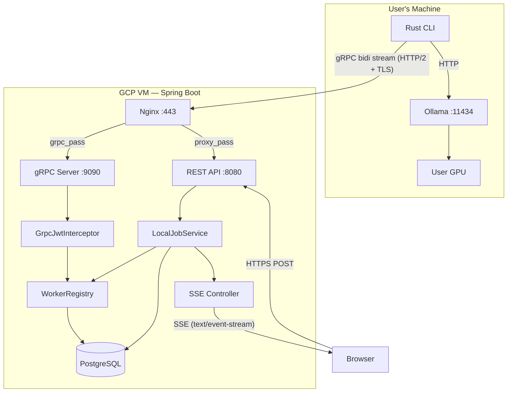
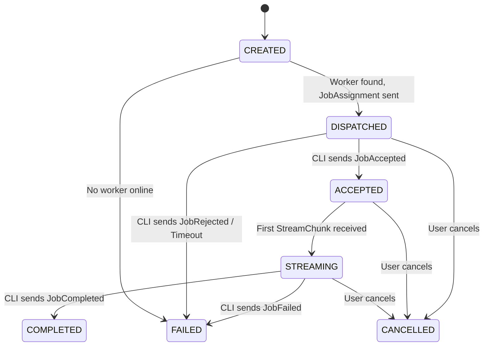

# Local Compute Agent — Complete Implementation Plan

> Spring Boot backend for persistent gRPC communication with a Rust CLI that runs Ollama on the user's local GPU.

> [!NOTE]
> **Milestone 1 is complete.** The gRPC server is running, the `.proto` contract compiles, and `LocalWorkerGrpcService` handles the bidirectional `Connect` stream with Hello/Ack.

---

## Architecture Overview



---

## Milestone Map

| Milestone | Scope | New Files | Modified Files |
|---|---|---|---|
| ~~1~~ | ~~gRPC connectivity~~ | ~~proto, GrpcService~~ | ~~pom.xml, yaml, Dockerfile~~ |
| **2** | Auth + Worker Registry | 5 new files | 2 modified |
| **3** | Job Dispatch | 4 new files | 2 modified |
| **4** | Response Streaming to Browser | 2 new files | 1 modified |
| **5** | Cancellation + Connection Loss | 1 new file | 3 modified |
| **6** | Production Hardening + Nginx | 0 new Java files | 3 modified + infra |

---

## Milestone 2 — Authentication + Worker Identity + Registry

### Goal

```text
Rust CLI authenticates via JWT
        ↓
Spring Boot validates at gRPC boundary
        ↓
CLI sends RegisterWorker
        ↓
Spring Boot persists worker identity
        ↓
Spring Boot tracks active connection in memory
        ↓
Heartbeats keep worker alive
```

### What Gets Built

#### 2A — gRPC Authentication Interceptor

A `GrpcJwtInterceptor` that runs before any stream handler:

```text
CLI sends:  Authorization: Bearer <jwt>  (as gRPC metadata)
                    ↓
GrpcJwtInterceptor
    ├── Extract token from metadata
    ├── Call existing JwtService.validateToken()
    ├── Call existing JwtService.extractUserId()
    ├── Store userId in gRPC Context
    └── Reject with UNAUTHENTICATED if invalid
```

> [!IMPORTANT]
> This reuses the **existing `JwtService`** — no new auth system. The same JWT the browser uses can authenticate the CLI. For MVP, the user can copy their JWT from the browser's localStorage and pass it to the CLI.

**New file:** `grpc/interceptor/GrpcJwtInterceptor.java`

#### 2B — Worker Identity (Database)

A new JPA entity to persist worker metadata across restarts:

```text
local_workers
─────────────────────────
id              UUID (PK)
user_id         VARCHAR (FK → users.id)
device_name     VARCHAR
cli_version     VARCHAR
last_seen_at    TIMESTAMP
created_at      TIMESTAMP
```

**New files:**
- `entity/LocalWorker.java`
- `repository/LocalWorkerRepository.java`
- Flyway migration: `db/migration/V8__create_local_workers_table.sql`

#### 2C — Active Connection Registry (In-Memory)

A thread-safe registry mapping `workerId` → active gRPC stream:

```text
WorkerRegistry
    │
    ├── register(workerId, userId, StreamObserver) → WorkerConnection
    ├── unregister(workerId)
    ├── getConnection(workerId) → Optional<WorkerConnection>
    ├── getConnectionForUser(userId) → Optional<WorkerConnection>
    ├── isOnline(workerId) → boolean
    └── sendToWorker(workerId, ServerMessage) → boolean
```

`WorkerConnection` wraps the raw `StreamObserver` and holds metadata:

```text
WorkerConnection
    │
    ├── workerId
    ├── userId
    ├── StreamObserver<ServerMessage>
    ├── connectedAt
    └── lastHeartbeatAt
```

**New file:** `grpc/registry/WorkerRegistry.java`

#### 2D — Proto Contract Changes

Add to [local_worker.proto](file:///home/satya/Documents/Insights/Backend/api/src/main/proto/local_worker.proto):

```text
WorkerMessage.oneof:
  + RegisterWorker register = 2
  + Heartbeat      heartbeat = 3

ServerMessage.oneof:
  + RegistrationAck registration_ack = 2

New messages:
  + RegisterWorker { worker_id, device_name, cli_version, repeated available_models }
  + Heartbeat { worker_id, timestamp }
  + RegistrationAck { success, worker_id, message }
```

> [!TIP]
> `WorkerHello` from Milestone 1 gets retired in favor of `RegisterWorker` — same concept but richer. The `hello` field stays in the proto for backward compat but the server will treat `register` as the canonical registration message.

#### 2E — Update LocalWorkerGrpcService

The service will now:
1. Extract `userId` from `GrpcJwtInterceptor`'s Context.
2. Handle `RegisterWorker` → validate ownership → persist worker → register connection → send `RegistrationAck`.
3. Handle `Heartbeat` → update `lastHeartbeatAt` in registry and `lastSeenAt` in DB.
4. On `onError`/`onCompleted` → unregister from `WorkerRegistry`, mark worker offline.

#### 2F — Stale Worker Detection

A `@Scheduled` task that runs every 60 seconds:
- Scans `WorkerRegistry` for connections where `lastHeartbeatAt` is older than 90 seconds.
- Forcefully closes the gRPC stream and unregisters the worker.

### Success Criteria

```text
✓ Unauthenticated CLI connection is rejected with UNAUTHENTICATED
✓ Authenticated CLI can register, gets RegistrationAck
✓ Worker appears in database
✓ WorkerRegistry shows worker as ONLINE
✓ Heartbeats keep lastSeenAt updated
✓ CLI disconnect → worker marked OFFLINE
✓ Duplicate connection from same worker closes the old one
```

---

## Milestone 3 — Job Dispatch

### Goal

```text
Browser POST /api/local/chat
        ↓
Spring Boot creates job
        ↓
Finds user's active worker
        ↓
Sends JobAssignment via gRPC
        ↓
CLI receives job
        ↓
CLI sends JobAccepted
```

### What Gets Built

#### 3A — Proto Contract Changes

```text
WorkerMessage.oneof:
  + JobAccepted   job_accepted   = 4
  + JobRejected   job_rejected   = 5
  + JobCompleted  job_completed  = 7
  + JobFailed     job_failed     = 8

ServerMessage.oneof:
  + JobAssignment job_assignment = 3

New messages:
  + JobAssignment { job_id, model, prompt, options }
  + JobAccepted { job_id }
  + JobRejected { job_id, reason }
  + JobCompleted { job_id, full_response }
  + JobFailed { job_id, error_message }
```

#### 3B — Job State Machine



> [!NOTE]
> For MVP, `ACCEPTED` and `STREAMING` could be merged into `RUNNING` if the distinction isn't needed by the frontend. Decision to be made at implementation time.

#### 3C — LocalJob (In-Memory for MVP)

For the first version, jobs will be tracked **in-memory only** using a `ConcurrentHashMap<String, LocalJob>`:

```text
LocalJob
    ├── jobId (UUID)
    ├── userId
    ├── workerId
    ├── model
    ├── prompt
    ├── status (enum)
    ├── createdAt
    ├── updatedAt
    └── errorMessage (nullable)
```

> [!TIP]
> Not persisting jobs to PostgreSQL yet keeps this milestone simple. If the server restarts, in-flight local jobs are lost — acceptable for MVP since the user can just re-submit. Database persistence can be added later.

#### 3D — LocalJobService

```text
LocalJobService
    │
    ├── submitJob(userId, model, prompt) → LocalJob
    │       ├── Create job (CREATED)
    │       ├── Find worker via WorkerRegistry.getConnectionForUser(userId)
    │       ├── Build JobAssignment protobuf
    │       ├── Send via WorkerRegistry.sendToWorker()
    │       └── Update status → DISPATCHED
    │
    ├── handleJobAccepted(workerId, jobId)
    │       ├── Validate worker owns this job
    │       └── Update status → ACCEPTED
    │
    ├── handleJobCompleted(workerId, jobId, response)
    │       ├── Validate
    │       └── Update status → COMPLETED
    │
    ├── handleJobFailed(workerId, jobId, error)
    │       └── Update status → FAILED
    │
    └── getJob(jobId) → Optional<LocalJob>
```

**New files:**
- `dto/request/LocalChatRequest.java`
- `model/LocalJob.java`
- `service/LocalJobService.java`
- `controller/LocalChatController.java`

#### 3E — REST Endpoint

```text
POST /api/local/chat
Content-Type: application/json
Authorization: Bearer <jwt>

{
  "model": "qwen2.5:7b",
  "prompt": "Explain this codebase"
}

Response:
{
  "jobId": "abc-123",
  "status": "DISPATCHED"
}
```

#### 3F — Wire Worker Events to LocalJobService

Update `LocalWorkerGrpcService` to route new message types:

```text
case JOB_ACCEPTED  → localJobService.handleJobAccepted(workerId, msg)
case JOB_REJECTED  → localJobService.handleJobFailed(workerId, msg)
case JOB_COMPLETED → localJobService.handleJobCompleted(workerId, msg)
case JOB_FAILED    → localJobService.handleJobFailed(workerId, msg)
```

### Success Criteria

```text
✓ POST /api/local/chat returns jobId with status DISPATCHED
✓ CLI receives JobAssignment on its gRPC stream
✓ CLI sends JobAccepted → job status updates to ACCEPTED
✓ If no worker is online → immediate FAILED response
✓ Job ownership is enforced (worker can only update its own jobs)
```

---

## Milestone 4 — Response Streaming to Browser

### Goal

```text
Ollama → Rust CLI → gRPC StreamChunk → Spring Boot → SSE → Browser
```

### What Gets Built

#### 4A — Proto Contract Changes

```text
WorkerMessage.oneof:
  + StreamChunk stream_chunk = 6

New message:
  + StreamChunk { job_id, string content, bool is_final }
```

#### 4B — SSE Controller for Local Inference

A new SSE endpoint following the existing pattern in [IndexingSSEController.java](file:///home/satya/Documents/Insights/Backend/api/src/main/java/com/codebasecartographer/api/controller/IndexingSSEController.java):

```text
GET /api/local/chat/{jobId}/stream?access_token=<jwt>
Content-Type: text/event-stream

event: chunk
data: {"content": "The "}

event: chunk
data: {"content": "codebase "}

event: chunk
data: {"content": "uses..."}

event: done
data: {"jobId": "abc-123", "status": "COMPLETED"}
```

**New file:** `controller/LocalChatSSEController.java`

#### 4C — Chunk Routing

`LocalJobService` gains a chunk routing mechanism:

```text
LocalJobService
    │
    ├── registerBrowserStream(jobId, SseEmitter)
    │
    ├── handleStreamChunk(workerId, StreamChunk)
    │       ├── Validate ownership
    │       ├── Find SseEmitter for jobId
    │       └── Forward chunk via SSE
    │
    └── handleBrowserDisconnect(jobId)
            └── (For MVP: just remove emitter, let inference finish)
```

Uses `ConcurrentHashMap<String, SseEmitter>` internally — same pattern as the existing indexing SSE controller.

#### 4D — Typical Flow

```text
1. Browser: POST /api/local/chat → gets jobId
2. Browser: GET /api/local/chat/{jobId}/stream → SSE opens
3. Spring Boot stores SseEmitter keyed by jobId
4. CLI streams chunks → gRPC → Spring Boot
5. LocalJobService finds emitter → forwards each chunk
6. CLI sends JobCompleted → Spring Boot sends "done" SSE event → completes emitter
```

### Success Criteria

```text
✓ Browser receives real-time token-by-token streaming from local Ollama
✓ SSE events are properly formatted and named
✓ If browser disconnects, SSE emitter is cleaned up (no exceptions)
✓ JobCompleted closes the SSE stream cleanly
```

---

## Milestone 5 — Cancellation + Connection Loss

### Goal

```text
Cancellation:  Browser → REST → gRPC → CLI → Ollama abort
Connection loss: gRPC drops → jobs fail → worker goes offline
```

### What Gets Built

#### 5A — Proto Contract Changes

```text
ServerMessage.oneof:
  + CancelJob cancel_job = 4

WorkerMessage.oneof:
  + JobCancelled job_cancelled = 9

New messages:
  + CancelJob { job_id }
  + JobCancelled { job_id }
```

#### 5B — Cancellation REST Endpoint

```text
POST /api/local/chat/{jobId}/cancel
Authorization: Bearer <jwt>

Response: 200 OK
```

#### 5C — Cancellation Flow in LocalJobService

```text
cancelJob(userId, jobId)
    ├── Validate user owns this job
    ├── Check job is in cancellable state (DISPATCHED, ACCEPTED, STREAMING)
    ├── Find worker connection
    ├── Send CancelJob via gRPC
    ├── Update status → CANCELLED
    └── Complete SSE emitter with "cancelled" event
```

#### 5D — Connection Loss Handling

Update `LocalWorkerGrpcService.onError()`:

```text
onError(Throwable t)
    ├── Extract workerId from connection context
    ├── WorkerRegistry.unregister(workerId)
    ├── Find all in-flight jobs for this worker
    ├── Mark each → FAILED (reason: "Worker disconnected")
    ├── Complete each job's SSE emitter with error event
    └── Update worker lastSeenAt in DB
```

#### 5E — Dispatch Timeout

A scheduled task that checks dispatched jobs:

```text
Every 30 seconds:
  For each job in DISPATCHED state:
    If (now - dispatchedAt) > 30 seconds:
      Mark → FAILED (reason: "Worker did not accept job")
      Complete SSE emitter with error
```

**New file:** `service/LocalJobTimeoutService.java`

### Success Criteria

```text
✓ User clicks Stop → CLI receives CancelJob → Ollama request aborted
✓ Cancellation is idempotent (cancelling already-cancelled job is a no-op)
✓ CLI crash mid-stream → job marked FAILED → browser gets error SSE event
✓ Dispatched job with no response in 30s → auto-fails
```

---

## Milestone 6 — Production Hardening + Nginx

### Goal

```text
Production-ready deployment with TLS, proper timeouts,
and Nginx proxying both REST and gRPC.
```

### What Gets Built

#### 6A — Nginx Configuration (Manual + Template)

I will provide a complete Nginx config template. You will need to adapt and deploy it manually.

```text
                        :443
                          │
                   ┌──────┴──────┐
                   │    Nginx    │
                   │  TLS term   │
                   └──────┬──────┘
                          │
              ┌───────────┴───────────┐
              │                       │
    /api/* → proxy_pass        /localworker.* → grpc_pass
    http://127.0.0.1:8080      grpc://127.0.0.1:9090
```

Key Nginx directives:
- `listen 443 ssl http2;` — HTTP/2 required for gRPC
- `grpc_pass grpc://127.0.0.1:9090;` — for gRPC routes
- `grpc_read_timeout 24h;` — prevent idle disconnect
- `grpc_send_timeout 24h;`
- `proxy_pass http://127.0.0.1:8080;` — for REST routes

#### 6B — gRPC KeepAlive Configuration

Add to `application.yaml`:

```yaml
grpc:
  server:
    port: 9090
    keep-alive-time: 30s
    keep-alive-timeout: 10s
    permit-keep-alive-time: 20s
    permit-keep-alive-without-calls: true
```

This ensures HTTP/2 PING frames flow frequently enough to keep NAT tables and Nginx alive.

#### 6C — Duplicate Connection Handling

Update `WorkerRegistry.register()`:

```text
register(workerId, newConnection)
    ├── Check if workerId already has an active connection
    ├── If yes:
    │     ├── Log warning "Duplicate connection for worker X"
    │     ├── Close OLD stream (responseObserver.onCompleted())
    │     └── Remove old entry
    └── Store new connection
```

Last-writer-wins policy.

#### 6D — Graceful Shutdown

Ensure Spring Boot's `shutdown: graceful` (already configured) also shuts down gRPC streams cleanly:

```text
Server shutdown initiated
    ├── Stop accepting new gRPC connections
    ├── Send ServerMessage with error/goodbye to all active streams
    ├── Wait for timeout-per-shutdown-phase (30s)
    └── Force close remaining streams
```

#### 6E — Docker Changes

Update Dockerfile or `docker run` command to map both ports:

```bash
docker run -p 8080:8080 -p 9090:9090 ...
```

### Manual Steps Checklist

| # | Task | Details |
|---|---|---|
| 1 | **DNS Record** | Create `grpc.codebasecartographer.com` (or use existing domain) pointing to GCP VM IP |
| 2 | **SSL Certificate** | Obtain TLS cert covering the gRPC subdomain (Let's Encrypt / Certbot) |
| 3 | **GCP Firewall** | Ensure port 443 is open. Ports 8080 and 9090 should be **blocked** from public (Nginx-only access) |
| 4 | **Nginx Install** | Install Nginx with HTTP/2 and gRPC module support (`nginx-full` or compiled with `--with-http_v2_module`) |
| 5 | **Nginx Config** | Deploy the provided config template to `/etc/nginx/sites-available/` |
| 6 | **Docker Networking** | If Spring Boot runs in Docker, ensure Nginx can reach `127.0.0.1:8080` and `127.0.0.1:9090` (use `--network host` or Docker bridge) |
| 7 | **Environment Variables** | Set `JWT_SECRET`, database credentials, etc. in production `.env` |
| 8 | **External Test** | From an external machine, run the Rust CLI pointing at `grpc.codebasecartographer.com:443` with TLS enabled |

### Success Criteria

```text
✓ Rust CLI connects from an external network through Nginx to Spring Boot
✓ gRPC stream stays alive for hours without timeout
✓ TLS is properly terminated at Nginx
✓ REST API continues to work alongside gRPC on the same domain
✓ Server restart → CLI reconnects automatically (CLI-side responsibility)
```

---

## Complete File Inventory

### New Files (across all milestones)

```text
Milestone 1 (done):
  src/main/proto/local_worker.proto
  src/main/java/.../grpc/service/LocalWorkerGrpcService.java

Milestone 2:
  src/main/java/.../grpc/interceptor/GrpcJwtInterceptor.java
  src/main/java/.../grpc/registry/WorkerRegistry.java
  src/main/java/.../entity/LocalWorker.java
  src/main/java/.../repository/LocalWorkerRepository.java
  src/main/resources/db/migration/V8__create_local_workers_table.sql

Milestone 3:
  src/main/java/.../dto/request/LocalChatRequest.java
  src/main/java/.../model/LocalJob.java
  src/main/java/.../service/LocalJobService.java
  src/main/java/.../controller/LocalChatController.java

Milestone 4:
  src/main/java/.../controller/LocalChatSSEController.java
  (LocalJobService gains chunk routing — modification, not new file)

Milestone 5:
  src/main/java/.../service/LocalJobTimeoutService.java

Milestone 6:
  (No new Java files — config and infrastructure only)
```

### Modified Files (across all milestones)

```text
pom.xml                          — Milestone 1 (done)
application.yaml                 — Milestone 1 (done), 6
Dockerfile                       — Milestone 1 (done), 6
local_worker.proto               — Milestones 2, 3, 4, 5
LocalWorkerGrpcService.java      — Milestones 2, 3, 4, 5
```

---

## Estimated Implementation Sequence

```text
Milestone 2  ──►  Milestone 3  ──►  Milestone 4  ──►  Milestone 5  ──►  Milestone 6
   Auth            Job Dispatch      Streaming          Cancel/Loss       Production
   Registry        REST endpoint     SSE to browser     Timeouts          Nginx
   Heartbeat       State machine     Chunk routing      Cleanup           TLS
```

Each milestone is independently testable with a Rust CLI (or grpcurl for the auth-free portions). No milestone depends on Ollama actually being present — the CLI can send fake responses for testing.
