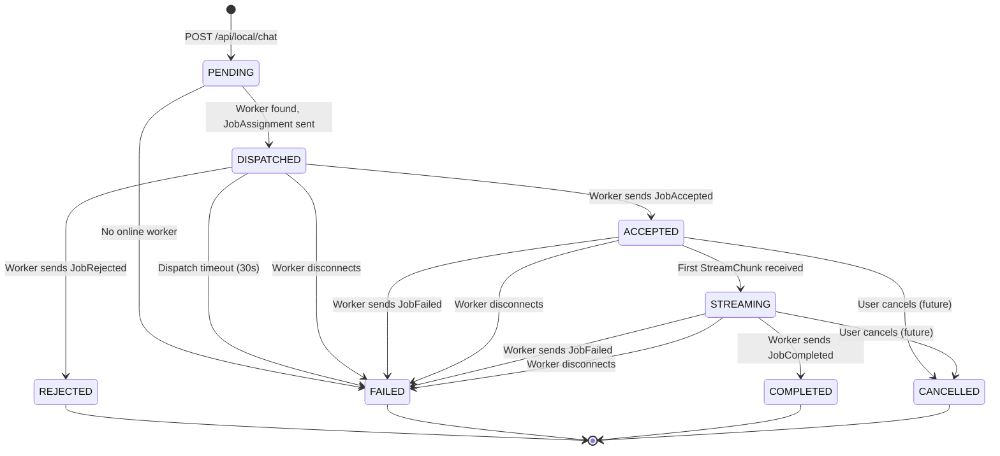

# Milestone 3 & 4 — Architecture Proposal

> Based on inspection of the current codebase as of Milestone 2.

---

## A. Current Code Assessment

### What exists and is ready to use

| Component | Status | What it provides for M3/M4 |
|---|---|---|
| [local_worker.proto](file:///home/satya/Documents/Insights/Backend/api/src/main/proto/local_worker.proto) | `WorkerMessage`/`ServerMessage` oneof envelopes with reserved comment slots at fields 4–9 and 2–3 | Clean extension points — we activate the reserved fields |
| [WorkerRegistry](file:///home/satya/Documents/Insights/Backend/api/src/main/java/com/codebasecartographer/api/grpc/registry/WorkerRegistry.java) | `sendToWorker(workerId, ServerMessage)` already exists, returns `false` on failure | Job dispatch is a single call to this method |
| [WorkerConnection](file:///home/satya/Documents/Insights/Backend/api/src/main/java/com/codebasecartographer/api/grpc/registry/WorkerConnection.java) | Holds `workerId`, `userId`, `StreamObserver<ServerMessage>` | Worker selection by userId already works via `getConnectionForUser()` |
| [LocalWorkerGrpcService](file:///home/satya/Documents/Insights/Backend/api/src/main/java/com/codebasecartographer/api/grpc/service/LocalWorkerGrpcService.java) | `onNext` switch with `default` branch logging unhandled types | New message types just need new `case` entries |
| [IndexingSSEController](file:///home/satya/Documents/Insights/Backend/api/src/main/java/com/codebasecartographer/api/controller/IndexingSSEController.java) | Battle-tested SSE pattern: `ConcurrentHashMap<String, SseEmitter>`, `X-Accel-Buffering: no`, heartbeat, `onCompletion`/`onTimeout`/`onError` cleanup, synchronized sends | Directly reusable pattern for streaming inference tokens to browser |
| [ChatRequest](file:///home/satya/Documents/Insights/Backend/api/src/main/java/com/codebasecartographer/api/dto/request/ChatRequest.java) | `record ChatRequest(String query, String llmProvider)` | Validates the local chat request shape we need |
| [QueryLog](file:///home/satya/Documents/Insights/Backend/api/src/main/java/com/codebasecartographer/api/entity/QueryLog.java) | JPA entity with `User` ManyToOne, `question`/`answer` TEXT, `tokensUsed`, `@PrePersist` | Pattern to follow for `LocalJob` entity |
| [RepositoryStatus](file:///home/satya/Documents/Insights/Backend/api/src/main/java/com/codebasecartographer/api/enums/RepositoryStatus.java) | Simple enum used with JPA `@Enumerated` | Pattern to follow for `LocalJobStatus` |
| Flyway migrations | V3_5 through V9, using `gen_random_uuid()` for PKs, `VARCHAR(255)` for IDs, explicit FK constraints | Convention to follow for V10 |

### What does NOT exist yet

- No `LocalJob` entity or state machine
- No `LocalJobService`
- No REST endpoint for submitting local inference jobs
- No SSE controller for streaming inference results
- No job-related protobuf messages
- No concept of job timeout or dispatch failure handling

### Key architectural constraint from existing code

The `LocalWorkerGrpcService` holds a `registeredWorkerId` per stream. The `onError`/`onCompleted` handlers call `cleanup()` which unregisters the worker. **This is where we'll hook job failure on disconnect** — the cleanup path already exists, we just need to add "fail all in-flight jobs for this worker" to it.

---

## B. Complete Data Flow

### Milestone 3 — Dispatch Only (no Ollama)

```text
Browser
  │ POST /api/local/chat
  ▼
LocalChatController
  │ authenticate user, validate request
  ▼
LocalJobService.submitJob(userId, model, prompt)
  ├── 1. Create LocalJob (status=PENDING, persist to DB)
  ├── 2. WorkerRegistry.getConnectionForUser(userId)
  │     └── No worker? → status=FAILED, return error
  ├── 3. Build JobAssignment protobuf
  ├── 4. WorkerRegistry.sendToWorker(workerId, msg)
  │     └── Send failed? → status=FAILED, return error
  └── 5. Update status → DISPATCHED, return jobId
              │
              ▼
      gRPC stream (already open)
              │
              ▼
        Rust CLI receives JobAssignment
              │
              ▼
        CLI validates, sends JobAccepted
              │
              ▼
LocalWorkerGrpcService.onNext → handleJobAccepted
              │
              ▼
LocalJobService.handleJobAccepted(workerId, jobId)
  └── Update status → ACCEPTED
```

### Milestone 4 — Full Execution + Streaming

```text
       (continues from ACCEPTED)
              │
              ▼
Rust CLI → Ollama HTTP (localhost:11434)
  │ POST /api/generate {model, prompt, stream: true}
  ▼
Ollama streams tokens
  │
  ▼
Rust CLI → StreamChunk (per token)
  │
  ▼
LocalWorkerGrpcService.onNext → handleStreamChunk
  │
  ▼
LocalJobService.handleStreamChunk(workerId, jobId, content)
  ├── Update status → STREAMING (on first chunk)
  └── Forward to SseEmitter for this jobId
              │
              ▼
         SSE → Browser
              │
              ▼
Rust CLI → JobCompleted (after final token)
  │
  ▼
LocalJobService.handleJobCompleted(workerId, jobId, fullResponse)
  ├── Update status → COMPLETED
  ├── Persist final response text to DB
  └── Complete SseEmitter
              │
              ▼
Browser receives "done" SSE event
```

---

## C. Proposed Proto Changes

### New messages for `WorkerMessage` oneof

```protobuf
message WorkerMessage {
  oneof payload {
    WorkerHello       hello          = 1;  // M1 (kept)
    RegisterWorker    register       = 2;  // M2 (kept)
    Heartbeat         heartbeat      = 3;  // M2 (kept)
    JobAccepted       job_accepted   = 4;  // M3
    JobRejected       job_rejected   = 5;  // M3
    StreamChunk       stream_chunk   = 6;  // M4
    JobCompleted      job_completed  = 7;  // M4
    JobFailed         job_failed     = 8;  // M4
  }
}
```

### New messages for `ServerMessage` oneof

```protobuf
message ServerMessage {
  oneof payload {
    ServerAck         ack            = 1;  // M1/M2 (kept)
    JobAssignment     job_assignment = 2;  // M3
    CancelJob         cancel_job     = 3;  // M4.1 (defined now, implemented later)
  }
}
```

### Message definitions

```protobuf
// ─────────────────────────────────────────────────────────────
// Milestone 3 — Job Dispatch
// ─────────────────────────────────────────────────────────────

// Server → Worker: dispatches an inference job.
message JobAssignment {
  string job_id   = 1;  // UUID generated by Spring Boot
  string model    = 2;  // Ollama model name (e.g. "qwen2.5:7b")
  string prompt   = 3;  // User's input prompt
  // Future: repeated string context_chunks = 4;  // RAG context
  // Future: map<string, string> options = 5;      // Temperature, etc.
}

// Worker → Server: job received and will be executed.
message JobAccepted {
  string job_id   = 1;
}

// Worker → Server: job cannot be executed.
message JobRejected {
  string job_id   = 1;
  string reason   = 2;  // e.g. "Model qwen2.5:7b not available"
}

// ─────────────────────────────────────────────────────────────
// Milestone 4 — Execution + Streaming
// ─────────────────────────────────────────────────────────────

// Worker → Server: a token/chunk from Ollama's streaming response.
message StreamChunk {
  string job_id   = 1;
  string content  = 2;  // The token text (one or more characters)
}

// Worker → Server: inference completed successfully.
message JobCompleted {
  string job_id        = 1;
  string full_response = 2;  // Complete concatenated response
  int32  tokens_used   = 3;  // Total token count from Ollama metadata
}

// Worker → Server: inference failed.
message JobFailed {
  string job_id  = 1;
  string error   = 2;  // Human-readable error description
}

// Server → Worker: cancel a running job.
message CancelJob {
  string job_id = 1;
}
```

### Backward compatibility

- Existing fields 1–3 in both envelopes are untouched.
- Fields 4–8 in `WorkerMessage` and 2–3 in `ServerMessage` use the exact numbers that were already reserved in comments.
- Old CLIs (Milestone 2) that don't understand `JobAssignment` will hit the `default` branch in their message handler and ignore it. This is safe — the server should not dispatch to unregistered workers anyway.
- All new messages are additive — no field renumbering, no removed messages.

### Design decisions

**Why `full_response` in `JobCompleted` rather than reassembling on the server:**
The server receives individual `StreamChunk`s but does NOT buffer them. Chunks are forwarded directly to the SSE emitter and discarded. The CLI, which already has the complete response from Ollama, sends it once in `JobCompleted`. This avoids the server needing to concatenate an unbounded number of chunks in memory and handles the case where the SSE listener wasn't connected during some chunks.

**Why no `JobStarted` message:**
Unnecessary state. `JobAccepted` means "I will execute this." The first `StreamChunk` implicitly marks execution as started. Adding `JobStarted` between `Accepted` and the first chunk would create a state (`RUNNING`) that the server can't meaningfully act on differently from `ACCEPTED`. If we later need to distinguish "accepted but waiting for Ollama to load the model" from "actively generating tokens," we can add it without a breaking change.

**Why `CancelJob` is defined now but implemented later:**
Reserving the field number in the proto now ensures wire compatibility. The Rust CLI can include a handler that logs "cancel not yet supported" and returns `JobFailed`. This costs nothing and avoids a proto-breaking change when we add real cancellation.

---

## D. Job State Machine



### State definitions

| State | Who sets it | Event | What happens |
|---|---|---|---|
| **PENDING** | `LocalJobService.submitJob()` | User submits local chat request | Job created in DB. Worker lookup begins. |
| **DISPATCHED** | `LocalJobService.submitJob()` | `WorkerRegistry.sendToWorker()` succeeds | `JobAssignment` sent via gRPC. Clock starts for dispatch timeout. |
| **ACCEPTED** | `LocalJobService.handleJobAccepted()` | Worker sends `JobAccepted` | Worker confirmed receipt. Waiting for Ollama output. |
| **REJECTED** | `LocalJobService.handleJobRejected()` | Worker sends `JobRejected` | Worker cannot execute (model unavailable, etc.). Terminal state. |
| **STREAMING** | `LocalJobService.handleStreamChunk()` | First `StreamChunk` arrives | Tokens are flowing. SSE is actively sending to browser. |
| **COMPLETED** | `LocalJobService.handleJobCompleted()` | Worker sends `JobCompleted` | Final response persisted. SSE "done" event sent. Terminal. |
| **FAILED** | Multiple paths | Timeout, disconnect, worker error, Ollama error | Error message persisted. SSE error event sent. Terminal. |
| **CANCELLED** | Future `LocalJobService.cancelJob()` | User clicks Stop in browser | `CancelJob` sent to worker. Terminal. |

### Invalid transitions (must be prevented)

| From | To | Why |
|---|---|---|
| COMPLETED | anything | Terminal state. Idempotent — ignore duplicates. |
| FAILED | anything | Terminal state. |
| CANCELLED | anything | Terminal state. |
| PENDING | ACCEPTED | Cannot skip DISPATCHED — must prove the message was sent. |
| STREAMING | ACCEPTED | Cannot go backward. |

### Implementation: all transitions go through a single method

```java
private boolean transition(LocalJob job, LocalJobStatus from, LocalJobStatus to) {
    if (job.getStatus() != from) {
        log.warn("Invalid transition: {} → {} (current: {})", from, to, job.getStatus());
        return false;
    }
    job.setStatus(to);
    job.setUpdatedAt(LocalDateTime.now());
    return true;
}
```

This prevents race conditions from duplicate gRPC messages.

---

## E. Persistence — `LocalJob` Entity

### Flyway migration V10

```sql
CREATE TABLE local_jobs (
    id            VARCHAR(255) PRIMARY KEY,
    user_id       VARCHAR(255) NOT NULL,
    worker_id     VARCHAR(255),               -- NULL until dispatched
    status        VARCHAR(32)  NOT NULL,       -- Enum stored as string
    model         VARCHAR(255) NOT NULL,
    prompt        TEXT         NOT NULL,
    response      TEXT,                         -- NULL until completed
    error         TEXT,                         -- NULL unless failed/rejected
    tokens_used   INTEGER      DEFAULT 0,
    created_at    TIMESTAMP    NOT NULL DEFAULT now(),
    updated_at    TIMESTAMP    NOT NULL DEFAULT now(),
    dispatched_at TIMESTAMP,                    -- For timeout calculation
    completed_at  TIMESTAMP,                    -- For metrics
    CONSTRAINT fk_local_jobs_user FOREIGN KEY (user_id) REFERENCES users(id)
);

CREATE INDEX idx_local_jobs_user_id ON local_jobs(user_id);
CREATE INDEX idx_local_jobs_worker_id ON local_jobs(worker_id);
CREATE INDEX idx_local_jobs_status ON local_jobs(status);
```

### Why persist immediately (not in-memory)

1. **Crash recovery.** If Spring Boot restarts, in-memory jobs are lost. Persisted jobs in `DISPATCHED` or `ACCEPTED` state can be detected as orphaned and failed on startup.
2. **Query history.** The user should see their local inference history alongside cloud inference history (`QueryLog`).
3. **Metrics.** `created_at` vs `completed_at` gives inference latency. `tokens_used` enables usage tracking.
4. **Consistency with existing patterns.** `QueryLog` already persists every query. `LocalJob` follows the same convention.

### Why `response` is stored (not just chunks)

The CLI sends the complete `full_response` in `JobCompleted`. We store it once. We never store individual `StreamChunk`s — they are ephemeral, forwarded to SSE, and discarded. This keeps the table size proportional to job count, not token count.

### JPA entity (follows [QueryLog](file:///home/satya/Documents/Insights/Backend/api/src/main/java/com/codebasecartographer/api/entity/QueryLog.java) pattern)

```text
LocalJob
├── id           (UUID, GeneratedValue)
├── userId       (VARCHAR, FK → users.id)
├── workerId     (VARCHAR, nullable — set on dispatch)
├── status       (Enum → LocalJobStatus)
├── model        (VARCHAR — Ollama model name)
├── prompt       (TEXT)
├── response     (TEXT, nullable)
├── error        (TEXT, nullable)
├── tokensUsed   (Integer, default 0)
├── createdAt    (Timestamp, @PrePersist)
├── updatedAt    (Timestamp)
├── dispatchedAt (Timestamp, nullable)
└── completedAt  (Timestamp, nullable)
```

---

## F. Responsibility Boundaries

### `LocalJobService` — business logic owner

```text
submitJob(userId, model, prompt) → LocalJob
  ├── Create LocalJob (PENDING)
  ├── Find worker via WorkerRegistry
  ├── Build and send JobAssignment via WorkerRegistry.sendToWorker()
  ├── Update status → DISPATCHED
  └── Return job (with jobId for SSE subscription)

handleJobAccepted(workerId, jobId)
  └── Validate ownership → DISPATCHED → ACCEPTED

handleJobRejected(workerId, jobId, reason)
  └── Validate → DISPATCHED → REJECTED, store error

handleStreamChunk(workerId, jobId, content)
  ├── ACCEPTED → STREAMING (on first chunk)
  └── Forward content to SseEmitter

handleJobCompleted(workerId, jobId, fullResponse, tokensUsed)
  ├── STREAMING/ACCEPTED → COMPLETED
  ├── Store response + tokensUsed
  └── Complete SseEmitter

handleJobFailed(workerId, jobId, error)
  └── Any non-terminal → FAILED, store error, complete SseEmitter with error

handleWorkerDisconnect(workerId)
  └── Find all jobs for workerId in {DISPATCHED, ACCEPTED, STREAMING}
      → FAILED (reason: "Worker disconnected"), complete SseEmitters

registerBrowserStream(jobId, SseEmitter)
  └── Store emitter for chunk forwarding

cancelJob(userId, jobId) — future
```

### `WorkerRegistry` — connection plumbing only

No changes needed. It already has everything:
- `getConnectionForUser(userId)` for worker selection
- `sendToWorker(workerId, message)` for dispatch
- `unregister(workerId)` called from the gRPC stream's `onError`/`onCompleted`

The registry knows nothing about jobs. It just manages connections and sends messages.

### `LocalWorkerGrpcService` — message router

Adds new `case` entries to the `onNext` switch:
```text
case JOB_ACCEPTED  → localJobService.handleJobAccepted(workerId, msg)
case JOB_REJECTED  → localJobService.handleJobRejected(workerId, msg)
case STREAM_CHUNK  → localJobService.handleStreamChunk(workerId, msg)
case JOB_COMPLETED → localJobService.handleJobCompleted(workerId, msg)
case JOB_FAILED    → localJobService.handleJobFailed(workerId, msg)
```

And enhances `cleanup()`:
```text
cleanup()
  ├── workerRegistry.unregister(workerId)        // existing
  └── localJobService.handleWorkerDisconnect(workerId)  // new
```

### `LocalChatController` — REST entry point

```text
POST /api/local/chat        → submitJob, return jobId
GET  /api/local/chat/{id}/stream  → SSE emitter for streaming tokens
```

### Boundary summary

```text
┌──────────────────────────────────┐
│       LocalChatController        │  REST endpoints
│    (HTTP in, HTTP/SSE out)       │
└──────────────┬───────────────────┘
               │
┌──────────────▼───────────────────┐
│         LocalJobService          │  State machine, business rules
│  (owns LocalJob lifecycle)       │
└──────┬──────────────────┬────────┘
       │                  │
┌──────▼──────┐    ┌──────▼──────┐
│WorkerRegistry│   │ SseEmitter  │
│ (connections)│   │  (browser)  │
└──────┬──────┘    └─────────────┘
       │
┌──────▼──────────────────────────┐
│    LocalWorkerGrpcService       │  Message routing only
│  (gRPC ↔ LocalJobService)       │
└─────────────────────────────────┘
```

---

## G. Worker Selection

**MVP: most-recently-heartbeated worker for the user.**

The current `getConnectionForUser(userId)` uses `stream().findFirst()`, which returns an arbitrary worker. For a deterministic MVP, sort by `lastHeartbeatAt` descending:

```java
public Optional<WorkerConnection> getConnectionForUser(String userId) {
    return connections.values().stream()
            .filter(conn -> conn.getUserId().equals(userId))
            .max(Comparator.comparing(WorkerConnection::getLastHeartbeatAt));
}
```

This selects the most recently active worker, which is the most likely to be responsive. No distributed load balancing needed.

**Validation:** Before dispatching, verify the selected worker's `workerId` against the `local_workers` table to confirm ownership. This is already guaranteed by the registration flow (the `GrpcJwtInterceptor` authenticated the user, and registration validates ownership), so no additional check is needed at dispatch time.

---

## H. Failure Handling

### Scenario 1: No worker online

```text
POST /api/local/chat
  → WorkerRegistry.getConnectionForUser(userId) returns empty
  → Job created with status=FAILED, error="No connected worker"
  → HTTP 409 Conflict (or 503 Service Unavailable)
```

No job is dispatched. The user sees an immediate error.

### Scenario 2: gRPC send fails at dispatch

```text
WorkerRegistry.sendToWorker(workerId, jobAssignment) returns false
  → sendToWorker already calls unregister() internally on failure
  → Job updated: status=FAILED, error="Failed to send to worker"
```

The job was created but never reached the worker. Clean failure.

### Scenario 3: Worker disconnects before `JobAccepted`

```text
Job is in DISPATCHED state
  → gRPC onError fires → cleanup() → handleWorkerDisconnect(workerId)
  → Find job with workerId + status=DISPATCHED
  → Transition to FAILED, error="Worker disconnected"
```

### Scenario 4: Worker disconnects during streaming

```text
Job is in STREAMING state
  → gRPC onError fires → cleanup() → handleWorkerDisconnect(workerId)
  → Find job with workerId + status=STREAMING
  → Transition to FAILED, error="Worker disconnected during inference"
  → SseEmitter sends error event and completes
```

The browser sees: "Worker disconnected" error.

### Scenario 5: Dispatch timeout (no `JobAccepted` within 30 seconds)

```text
@Scheduled(fixedRate = 15_000)
public void checkDispatchTimeouts() {
    Find all jobs WHERE status=DISPATCHED AND dispatched_at < (now - 30s)
    → Transition each to FAILED, error="Worker did not respond"
}
```

This handles the case where `sendToWorker` succeeded (the gRPC frame was sent) but the worker never processed it (crashed after receiving, blocked, etc.).

### Scenario 6: Ollama unavailable on worker

```text
Worker receives JobAssignment → tries to connect to localhost:11434
  → Connection refused
  → Worker sends JobRejected { reason: "Ollama is not running" }
  → LocalJobService: DISPATCHED → REJECTED
```

Or if Ollama fails mid-stream:
```text
Worker is streaming → Ollama returns error
  → Worker sends JobFailed { error: "Ollama error: model crashed" }
  → LocalJobService: STREAMING → FAILED
```

### Scenario 7: Requested model unavailable

```text
Worker receives JobAssignment → checks local models
  → Model not in Ollama
  → Worker sends JobRejected { reason: "Model qwen2.5:7b not found" }
```

### Scenario 8: Duplicate gRPC messages

The `transition(job, expectedFrom, to)` method prevents double-processing. If `JobCompleted` arrives twice (e.g., gRPC retry), the second call sees `status=COMPLETED` ≠ expected `STREAMING` and logs a warning without making changes. All terminal states are absorbing.

### Scenario 9: Job arrives for unknown `jobId`

```text
Worker sends JobAccepted { job_id: "nonexistent" }
  → localJobRepository.findById() returns empty
  → Log warning, ignore
```

No crash, no side effects.

---

## I. SSE Streaming to Browser (Milestone 4)

### Reusing the existing pattern

The [IndexingSSEController](file:///home/satya/Documents/Insights/Backend/api/src/main/java/com/codebasecartographer/api/controller/IndexingSSEController.java) uses:
- `ConcurrentHashMap<String, SseEmitter>` keyed by `repoId`
- `SseEmitter(Long.MAX_VALUE)` infinite timeout
- `X-Accel-Buffering: no` header for Nginx
- `@Scheduled(fixedRate = 15000)` heartbeat to prevent proxy timeouts
- `synchronized (emitter)` for thread-safe sends
- `onCompletion`, `onTimeout`, `onError` cleanup handlers

The local chat SSE will use the **exact same pattern**, keyed by `jobId` instead of `repoId`.

### SSE event types

```text
event: connected
data: "Stream opened"

event: chunk
data: {"content": "The "}

event: chunk
data: {"content": "codebase "}

event: done
data: {"jobId": "abc", "status": "COMPLETED", "tokensUsed": 142}

event: error
data: {"jobId": "abc", "status": "FAILED", "error": "Worker disconnected"}

event: blink
data: "keep-alive"
```

### Why not Spring's `ApplicationEventPublisher`

The indexing SSE controller uses `@EventListener` because indexing events originate from a background async service. For local chat, chunks arrive from `LocalWorkerGrpcService.onNext()` which calls `LocalJobService.handleStreamChunk()` directly. The `LocalJobService` holds the emitter map and can forward chunks without Spring events. Simpler, fewer indirections.

---

## J. Cancellation Design

### Recommendation: defer to Milestone 4.1

**Why not in Milestone 4:**
1. Cancellation requires the Rust CLI to abort an in-progress HTTP request to Ollama. This is non-trivial (needs `tokio::select!` or abort handle in Rust).
2. The `CancelJob` proto message is defined now, so no breaking change later.
3. Milestone 4 is already substantial (Ollama execution + streaming + SSE).
4. Without cancellation, the user can close the browser tab. The SSE emitter cleans up. Ollama finishes but the result is discarded. Acceptable for MVP.

**What we do now:** Define `CancelJob` in the proto. The Rust CLI can log "cancel received" and send `JobFailed { error: "Cancelled" }`. No Ollama abort yet.

**Milestone 4.1 adds:** Real Ollama request cancellation in Rust, `CANCELLED` job status on the server, and a `POST /api/local/chat/{id}/cancel` REST endpoint.

---

## K. Rust CLI Responsibilities

### Milestone 3 (dispatch only)

| Task | Details |
|---|---|
| Handle `JobAssignment` | Parse from `ServerMessage.job_assignment` |
| Validate minimally | Check `job_id`, `model`, `prompt` are non-empty |
| Send `JobAccepted` | If valid |
| Send `JobRejected` | If invalid (empty fields, etc.) |

No Ollama interaction. The CLI just proves it can receive and respond to jobs.

### Milestone 4 (execution)

| Task | Details |
|---|---|
| Ollama health check | `GET http://localhost:11434/` on startup |
| Model discovery | `GET http://localhost:11434/api/tags` → populate `available_models` in `RegisterWorker` |
| Execute inference | `POST http://localhost:11434/api/generate` with `{model, prompt, stream: true}` |
| Stream chunks | Each Ollama JSON line → extract `response` field → send `StreamChunk` |
| Send `JobCompleted` | After Ollama's `done: true` — include full concatenated response + token count |
| Send `JobFailed` | On Ollama connection error, HTTP error, or model not found |

### GPU Capability Model

The `RegisterWorker` message already has `repeated string available_models`. This is sufficient for MVP. The server doesn't need to know about GPU vendor, VRAM, or compute capability — it only needs to know which models the worker can execute.

If we later want richer capability reporting:

```protobuf
// Future addition to RegisterWorker (non-breaking):
message RegisterWorker {
  // ... existing fields 1-4 ...
  WorkerCapabilities capabilities = 5;  // Future
}

message WorkerCapabilities {
  string accelerator = 1;   // "cuda", "rocm", "metal", "cpu"
  int64  vram_bytes  = 2;   // GPU memory (0 for CPU)
  string os          = 3;   // "linux", "macos", "windows"
}
```

Not needed for MVP. The model list is enough.

---

## L. Sub-Milestone Breakdown

### M3a — Proto + Entity + Service (Spring Boot only)

**Spring Boot:**
- Update `local_worker.proto` with all M3/M4 messages (define them all now, handle incrementally)
- Create `LocalJobStatus` enum
- Create `LocalJob` entity + Flyway V10
- Create `LocalJobRepository`
- Create `LocalJobService` (submitJob, handleAccepted, handleRejected, handleWorkerDisconnect)
- Update `LocalWorkerGrpcService` to route new message types and call `LocalJobService`
- Enhance `cleanup()` to call `handleWorkerDisconnect()`

**Rust:** Nothing yet.

**Proto:** `JobAssignment`, `JobAccepted`, `JobRejected`, `StreamChunk`, `JobCompleted`, `JobFailed`, `CancelJob` — all defined. Only M3 types handled in code.

**Testing:**
```text
✓ mvn clean compile succeeds
✓ LocalJob persisted with status transitions
✓ Unit test: submitJob with no worker → FAILED
```

---

### M3b — REST Endpoint + Dispatch (Spring Boot)

**Spring Boot:**
- Create `LocalChatRequest` DTO
- Create `LocalChatResponse` DTO
- Create `LocalChatController` with `POST /api/local/chat`
- Update `SecurityConfig` if needed (the endpoint requires auth)
- Create `LocalJobTimeoutService` (scheduled task for dispatch timeouts)

**Rust:** Nothing yet.

**Testing:**
```text
✓ POST /api/local/chat with valid JWT → job created, status=DISPATCHED
✓ POST /api/local/chat with no worker online → 409/503 error
✓ Job in DISPATCHED for >30s → auto-fails
```

---

### M3c — CLI Job Handling (Rust)

**Spring Boot:** Nothing new.

**Rust:**
- Handle `JobAssignment` from gRPC stream
- Send `JobAccepted` or `JobRejected`

**Testing:**
```text
✓ POST /api/local/chat → CLI receives JobAssignment
✓ CLI sends JobAccepted → Spring Boot logs ACCEPTED
✓ Spring Boot job status transitions to ACCEPTED
```

---

### M4a — SSE Controller (Spring Boot)

**Spring Boot:**
- Create `LocalChatSSEController` with `GET /api/local/chat/{jobId}/stream`
- Add `registerBrowserStream(jobId, SseEmitter)` to `LocalJobService`
- Add chunk forwarding in `handleStreamChunk()`
- Add SSE heartbeat scheduled task
- Wire `handleJobCompleted` and `handleJobFailed` to complete the SseEmitter

**Rust:** Nothing yet.

**Testing:**
```text
✓ GET /api/local/chat/{jobId}/stream opens SSE connection
✓ SSE heartbeat ("blink") events arrive every 15s
✓ Manually calling handleStreamChunk → SSE "chunk" event arrives
```

---

### M4b — Ollama Execution (Rust)

**Rust:**
- Ollama health check on startup
- Model discovery → populate `available_models` in `RegisterWorker`
- On `JobAssignment`: call Ollama `/api/generate` with streaming
- Forward each token as `StreamChunk`
- Send `JobCompleted` with full response on finish
- Send `JobFailed` on error

**Spring Boot:** Nothing new (already handles all these message types from M3a + M4a).

**Testing (end-to-end):**
```text
✓ POST /api/local/chat → CLI calls Ollama → tokens stream via SSE → browser renders
✓ Request with unavailable model → CLI sends JobRejected → browser sees error
✓ Kill Ollama mid-stream → CLI sends JobFailed → browser sees error
✓ Disconnect CLI mid-stream → job transitions to FAILED → SSE error event
```

---

### M4.1 — Cancellation (Future, after M4b verified)

**Spring Boot:**
- `POST /api/local/chat/{jobId}/cancel`
- `LocalJobService.cancelJob()` → sends `CancelJob` via gRPC → `CANCELLED`

**Rust:**
- Handle `CancelJob` → abort Ollama HTTP request
- Send `JobFailed { error: "Cancelled by user" }`

---

## M. Risks / Decisions Needed

| # | Decision | Options | Recommendation |
|---|---|---|---|
| 1 | **Should `PENDING` and `DISPATCHED` be separate states?** | A) Merge into `DISPATCHED` (simpler) B) Keep separate (tracks "worker found" vs "message sent") | **B) Keep separate.** The gap between "job created" and "message sent" can fail (worker lookup, send failure). Separate states make debugging clearer. |
| 2 | **Should `LocalJob.response` store the full response?** | A) Store full response B) Don't store (ephemeral only) | **A) Store it.** Enables query history, re-display, and follows the existing `QueryLog.answer` pattern. Cost is one TEXT column per job. |
| 3 | **Should the SSE emitter map live in `LocalJobService` or a separate component?** | A) In `LocalJobService` B) Separate `LocalChatSSEManager` | **A) In `LocalJobService`** for MVP. It's the only consumer. Extract later if it grows. |
| 4 | **HTTP status when no worker is online?** | A) 409 Conflict B) 503 Service Unavailable C) 422 Unprocessable | **B) 503** with a clear message. The service is temporarily unavailable because the user's compute agent isn't connected. |
| 5 | **Should we update the Postman collection now?** | A) Yes, in the same commit B) Separately | **A) Yes**, add `POST /api/local/chat` and `GET /api/local/chat/{jobId}/stream` alongside the implementation. |
| 6 | **Should `CancelJob` be handled in M4 or M4.1?** | A) M4 with basic handling B) M4.1 separately | **B) M4.1.** Define the proto message now, implement real cancellation after the happy path is verified. |
